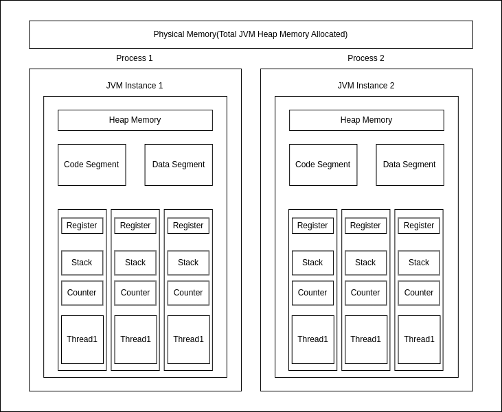
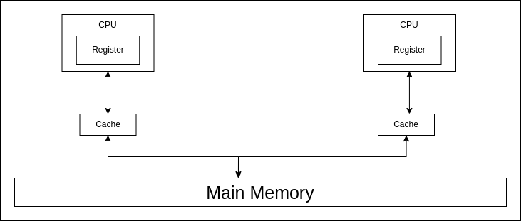

# Process and Threads in Java

## What is a Process?

A **Process** is an instance of a program that is being executed. It has its own resources such as memory, threads, etc. The operating system allocates these resources when the process is created.

### Key Points:
1. **Compilation**: Running `javac Test.java` generates bytecode that can be executed by the JVM.
2. **Execution**: When you run `java Test`, the JVM starts a new process. Here, `Test` is the class with the `public static void main(String[] args)` method.

### How Much Memory Does a Process Get?
When you create a process using the `java MainClassName` command, a new JVM instance is started. You can specify how much heap memory to allocate.

```bash
java -Xms256m -Xmx2g MainClassName
```

- **`-Xms<size>`**: Sets the initial heap size. In this case, it's 256 MB.
- **`-Xmx<size>`**: Sets the maximum heap size. In this case, it's 2 GB. If the process tries to allocate more than this, an `OutOfMemoryError` will be thrown.

---

## What is a Thread?

- A **Thread** is known as a lightweight process.
- Alternatively, it is the **smallest sequence of instructions** that can be executed independently by the CPU.
- One process can have multiple threads. When a process is created, it starts with one thread, called the **main thread**. From there, you can create additional threads to perform tasks concurrently.

### Example: Main Thread Creation

```java
public class Main {
    public static void main(String[] args) {
        System.out.println("Thread Name: " + Thread.currentThread().getName());
    }
}
```



---

## Multithreading

### Definition:
- **Multithreading** allows a program to perform multiple operations at the same time.
- Multiple threads share the same resource, such as memory space, but can still perform operations independently.

### Benefits:
- **Improved Performance**: Achieved through task parallelism.
- **Responsiveness**: Keeps the application responsive during execution.
- **Resource Sharing**: Multiple threads can share the same memory, improving efficiency.

### Challenges:
- **Concurrency Issues**: Problems like deadlocks and data inconsistency.
- **Synchronized Overhead**: Synchronization can add performance overhead.
- **Testing and Debugging**: Multithreaded programs are harder to test and debug due to concurrent execution.

---

## Multitasking vs. Multithreading

| **Aspect**        | **Multitasking**                                           | **Multithreading**                                           |
|-------------------|------------------------------------------------------------|--------------------------------------------------------------|
| **Definition**     | Executing different processes in parallel is called multitasking. | Executing different threads of the same process in parallel is called multithreading. |
| **Resource Sharing?** | No, two processes do not share the same resources.        | Yes, two threads share the same resources.                   |

---

## Memory Segments in a Process

### 1. Code Segment
- Contains the **compiled bytecode** of the Java program.
- It is **read-only**.
- All threads within the same process share the same code segment.

### 2. Data Segment
- Contains **global and static variables**.
- Shared among all threads within the same process.
- Threads can read and modify this data, so **synchronization** is required.

### 3. Heap
- The **heap** is where objects created at runtime (using the `new` keyword) are allocated.
- Shared among all threads in the same process.
- **Synchronization** is required when multiple threads access heap data.

### 4. Stack
- Each thread has its own **stack**.
- Manages **method calls** and **local variables**.

### 5. Register
- Used by **JIT** (Just-In-Time) compiler when it converts bytecode to native machine code.
- Helps with **context switching**.
- Each thread has its own registers.

### 6. Program Counter
- Also known as the **instruction counter**.
- Points to the next instruction to be executed.
- Increments after successfully executing each instruction.

---

## CPU Execution and Context Switching

- Each CPU core can execute **only one thread at a time**.
- If you have a system with four cores, four threads can be executed in parallel.

### Example: Single CPU, Multiple Threads
If you have **three threads** and **one CPU**, the CPU will execute one thread for a certain amount of time, store the state of that thread in its **registers**, and then move to the next thread. This process is called **context switching**. The CPU will continue switching between threads until all are executed.

Even if there is only **one thread**, context switching occurs, but it is not considered parallel execution.

---

## Diagram: Context Switching Example



---

### Managed by the JVM

All these segments and processes are managed by the **JVM** to ensure efficient execution of Java programs.

---