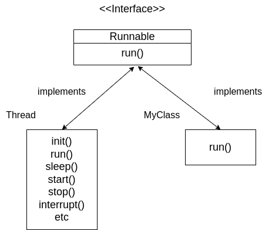
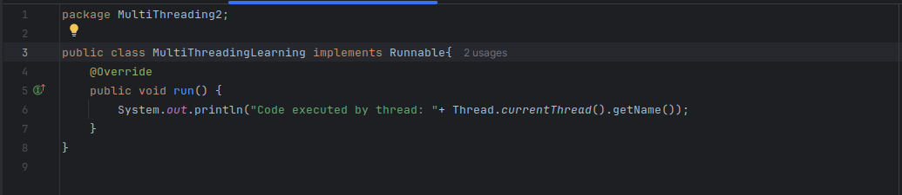
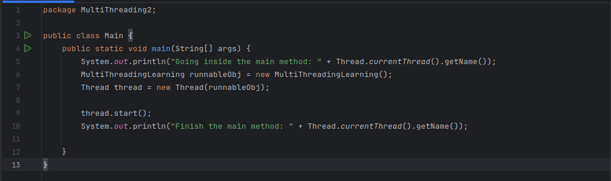
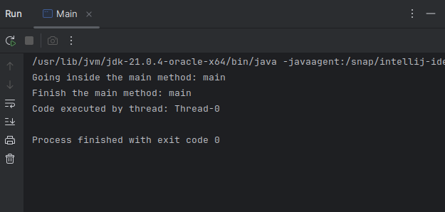

## Different Ways to Create Thread:
- Implementing Runnable Interface
- Extending Thread Class

## Step1: Create a runnable Object
- Create a class which implements runnable interface
- implement the run() method to tell the task which thread has to do.

## Step2: Start the Thread 
- Create an instance of class which implements runnable
- Pass the runnable object to the Thread constructor
- Start the thread

## Output

